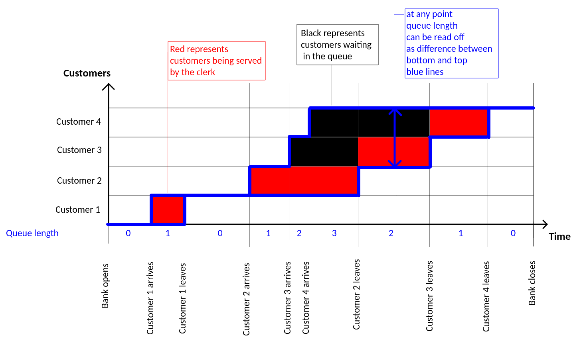

# bank-simulation

A solution to [bank simulation](https://www.notion.so/Bank-Simulation-94b50cdebe0b4da1b1297a7b01744682) exercise.

## How to run

The solution is a haskell stack project.
Assuming you have [stack installed](https://docs.haskellstack.org/en/stable/README/#how-to-install), you can execute it by running

```bash
git clone git@github.com:jhrcek/bank-simulation.git
cd bank-simulation
stack run
```

## Example output

```
$ stack run
Yellow customers only: what are the average and maximum customer waiting times?
    sample size =    10, average waiting time = 1.48 s, maximum waiting time = 9.83 s
    sample size =   100, average waiting time = 0.59 s, maximum waiting time = 12.34 s
    sample size =  1000, average waiting time = 0.49 s, maximum waiting time = 22.54 s
    sample size = 10000, average waiting time = 0.43 s, maximum waiting time = 29.66 s
Red customers only: what are the average and maximum queue lengths in-front of the teller?
    sample size =    10, average queue length = 1.48, maximum queue length = 5
    sample size =   100, average queue length = 0.51, maximum queue length = 5
    sample size =  1000, average queue length = 0.46, maximum queue length = 5
    sample size = 10000, average queue length = 0.44, maximum queue length = 7
Which type of customer gives the gives the closest value between the average and maximum customer waiting times?
    sample size =    10, The difference was minimal for Yellow customers: 8.35 s
    sample size =   100, The difference was minimal for Yellow customers: 11.74 s
    sample size =  1000, The difference was minimal for Yellow customers: 22.05 s
    sample size = 10000, The difference was minimal for Yellow customers: 29.23 s
```

## Solution details

- The following image represents my understanding of the situation we're simulating.


- The function from the assignment modelling customer arrival is [Cummulative distribution function](https://en.wikipedia.org/wiki/Cumulative_distribution_function), so we can use [Inverse transform sampling](https://en.wikipedia.org/wiki/Inverse_transform_sampling) to generate random arrival times. That is, starting from the function modelling arrival time of customers, we can invert it to get a function from interval [0,1] to arrival times. Applying that inverse function to a number sampled uniformly from interval [0,1] we get a random arrival time (as time delta from previous arrival in seconds). This is represented by `arrivalDelta` in the code.

- I'm using monad [MonadRandom](http://hackage.haskell.org/package/MonadRandom) to generate simulation entities (Customers). This allows for random data to be generated purely using [evalRand](https://www.stackage.org/haddock/nightly-2020-04-17/MonadRandom-0.5.1.2/Control-Monad-Random-Strict.html#v:evalRand), so particular simulations could potentially be reproduced by providing the same random generator seed `StdGen`.

- The average queue lenght is calculated as weighted average, using "Time the queue had length X" as weight.
